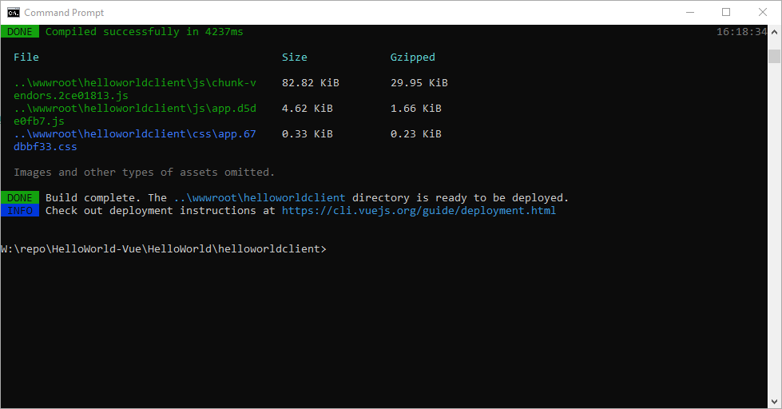

# Create a Real Time UI with Starcounter and Vue

### Introduction
By default, Starcounter uses Polymer and WebComponents. In this project, we will rely on Vue to handle user interaction.
### Before You Start
This project is a recreation of the complete Starcounter Hello World Tutorial (https://docs.starcounter.io/hello-world-tutorial)

### So how does this work?

#### 1. Set up the Vue project

I have used Vue CLI, a tool explained here: https://cli.vuejs.org/guide/installation.html

I have started with an existing C# project of Starcounter app.

By convention, I want `wwwroot/helloworldclient` to contain the built client-side files. So let's go to the directory that contains `HelloWorld.csproj` and create another subdirectory `helloworldclient` for the Vue project source files:

```
vue create helloworldclient
```

For all the questions asked by the CLI tool, press ENTER to accept the defaults.

Configure the Vue builder to respect our source and output directory preference:

```js
// HelloWorld/helloworldclient/vue.config.js
module.exports = {
   publicPath: '/helloworldclient',
   outputDir: "../wwwroot/helloworldclient"
}
```

If all goes well, running `npm run build` in `helloworldclient` should populate the folder `wwwroot/helloworldclient`.



#### 2. Connect the server and the client

Examine the source code of Palindrom Vue demo page: https://github.com/Palindrom/palindrom.github.io/blob/source/public/lab/vue/src/App.vue. This page gives us the good idea of what we need to connect to the Palindrom server (in our case: The Hello World Starcounter app)

First, install the dependencies:

```
npm install --save palindrom
```

Then, copy the interesting parts to `App.vue` with slight modifications relevant to Hello World demo. See the source at [`App.vue`](HelloWorld\helloworldclient\src\App.vue).

Palindrom constructor expects a URL to a Palindrom session. However the session URL is not known at the compilation time, because it is uniquely created in runtime at each user request. The session and its URL are constructed whenever the request to the application handler `/HelloWorld` happens. The best way to expose the session URL to the client is by sending it as the standard `Location` HTTP header or the response:

```c#
// HelloWorld/Program.cs
Handle.GET("/HelloWorld", () =>
{
      var resource = Db.Scope(() =>
      {
         /* ... */
      });
      var response = new Response()
      {
         Resource = resource,
      };
      response.Headers["Location"] = Session.Current.SessionUri;
      return response;
});
```

Re-build the Vue app (`cd helloworldclient && npm run build`). The updated files will show in `wwwroot/helloworldclient`.

When you now start HelloWorld start the app, Starcounter will host the static files and make the app available at http://localhost:8080/helloworldclient/index.html

In browser console, you will see the Palindrom session object.
