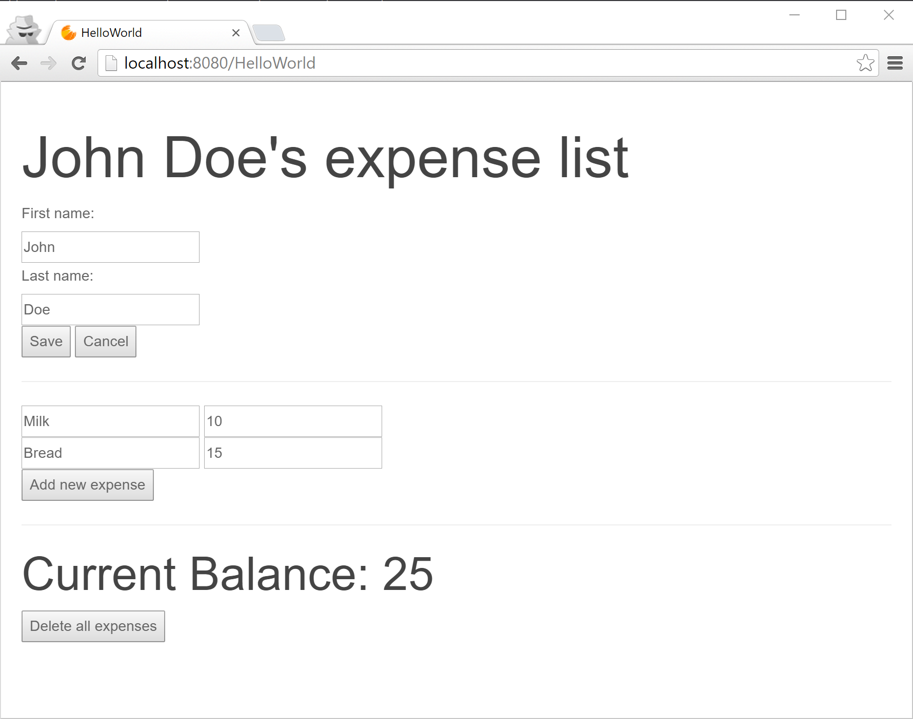

# HelloWorld
Sample Starcounter application that shows how to create an expense tracker that updates in real-time, calculates sums on the fly, and works seamlessly in tandem with other applications.

You can take the tutorial that explains how to create this application on [docs.starcounter.io](https://docs.starcounter.io/tutorial).

## How is this repo maintained?

See the [wiki page](https://github.com/StarcounterSamples/HelloWorld/wiki).
